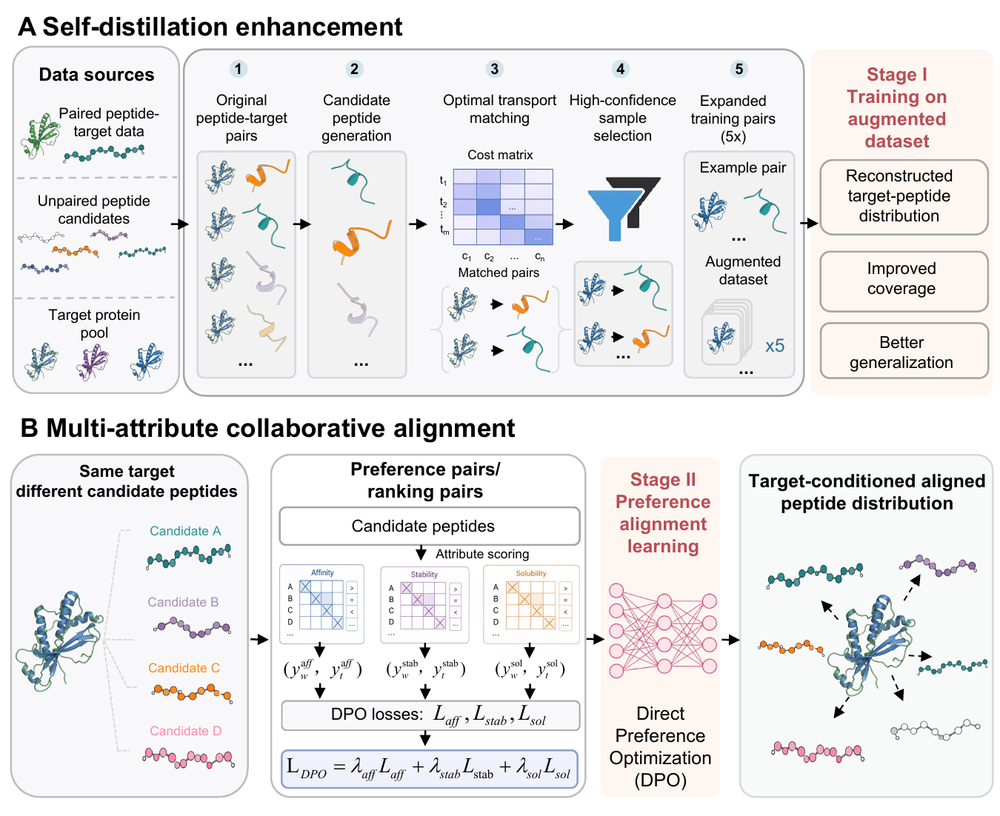

# PepDesign

PepDesign is a peptide design research codebase for training, preference optimization, generation, and evaluation of target-binding peptides. This repository is prepared as a lightweight manuscript-code release: source code and display-ready manuscript figures are included, while large datasets, docking outputs, generated structures, and model checkpoints are intentionally excluded from version control.

## Repository layout

```text
.
|-- train.py / train_DDP.py       # supervised/base training entry points
|-- models.py / models_DPO.py     # model definitions
|-- modules/                      # datasets, losses, transformer blocks, RL utilities
|-- utils/                        # preprocessing, augmentation, DPO, evaluation, plotting helpers
|-- scripts/                      # batch evaluation and structure-metric utilities
|-- results/                      # reproducible analysis/generation scripts for manuscript sections
|-- docs/figures/                 # PNG figures rendered directly in this README
|-- data/test_sets/               # lightweight benchmark/test-set definitions
|-- data/train_ids/               # lightweight training-set ID/list files
|-- checkpoints/                  # local checkpoint placeholder; weights are ignored
`-- requirements.txt              # lightweight Python dependency list
```

## Installation

```bash
conda create -n pepdesign python=3.10 -y
conda activate pepdesign
pip install -r requirements.txt
```

Some evaluation pipelines call external tools such as MMseqs2, docking/scoring software, ESMFold/OpenFold-style structure prediction, or MolProbity. Install those separately for the corresponding analyses.

## Data, test sets, and checkpoints

This repository does not include large training structures, generated complexes, docking outputs, or model weights. It does include lightweight test-set definitions under `data/test_sets/`:

- `data/test_sets/protein_level_test.csv`: protein-level held-out benchmark split.
- `data/test_sets/family_level_test.csv`: family-level held-out benchmark split.
- `data/test_sets/PPDbench_pep_fastas/`: PPDbench peptide FASTA shards used by the benchmark workflow.
- `data/test_sets/split_summary.json`: split-count summary.
- `data/train_ids/`: NR50 training-set ID/list files and clustering summaries.

The full PDB/receptor structure directories on the training server are much larger and are intentionally not committed to GitHub. Prepare these local paths before running full experiments:

- `data/`: processed peptide--receptor training data and benchmark structures
- `checkpoints/`: trained SFT/DPO checkpoints
- external docking and structure-quality tools available on `PATH` when required

## Training

Base/SFT-style training:

```bash
python train.py
```

Distributed training:

```bash
bash train_DDP.sh
# or
python train_DDP.py
```

DPO and multi-objective training scripts are provided under `utils/dpo/` and `results/3_Pareto_improved/`, for example:

```bash
python results/3_Pareto_improved/train_SFT_multi_objective.py
python results/3_Pareto_improved/train_DPO_weighted_sum.py
```

## Inference and generation

Generation scripts for the main benchmark and ablation experiments are under `results/3_Pareto_improved/`, `results/4_ablation/`, and `results/7_case/`:

```bash
python results/3_Pareto_improved/generate_ppdbench_SFT_multi_objective.py
python results/3_Pareto_improved/generate_ppdbench_DPO_weighted_sum.py
python results/4_ablation/generate_ppdbench_ablation_base_dpo.py
```

Unconditional baseline generation is under `results/2_SOTA/unconditional/`:

```bash
python results/2_SOTA/unconditional/generate_test_set_peptides.py
```

## Evaluation and figure generation

SOTA metric evaluation and plotting:

```bash
python scripts/eval_2_sota_metrics.py
python scripts/plot_2_sota_metrics.py
```

Additional manuscript analyses are organized by section:

- `results/1_OT/`: optimal-transport/data-augmentation analyses
- `results/2_SOTA/`: SOTA benchmark, novelty, structure quality, affinity, and similarity analyses
- `results/3_Pareto_improved/`: multi-objective Pareto analyses
- `results/4_ablation/`: ablation experiments
- `results/5_robustness/`: robustness analyses
- `results/6_Biophysical_consistency/`: biophysical consistency analyses
- `results/7_case/`: case-study generation scripts

## Manuscript figure

The manuscript framework figure is stored in `docs/figures/` so it renders directly on GitHub.



## Reproducibility notes

- Random seeds, split files, and benchmark manifests should be kept with the corresponding dataset release.
- Large generated structures and docking outputs should be archived outside GitHub, for example in Zenodo, figshare, OSF, or an institutional repository.
- If publishing the code with the manuscript, add dataset/checkpoint download links here once they are finalized.

## License

Please add the final project license before public release.

